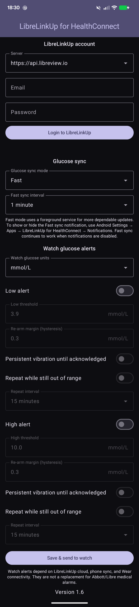
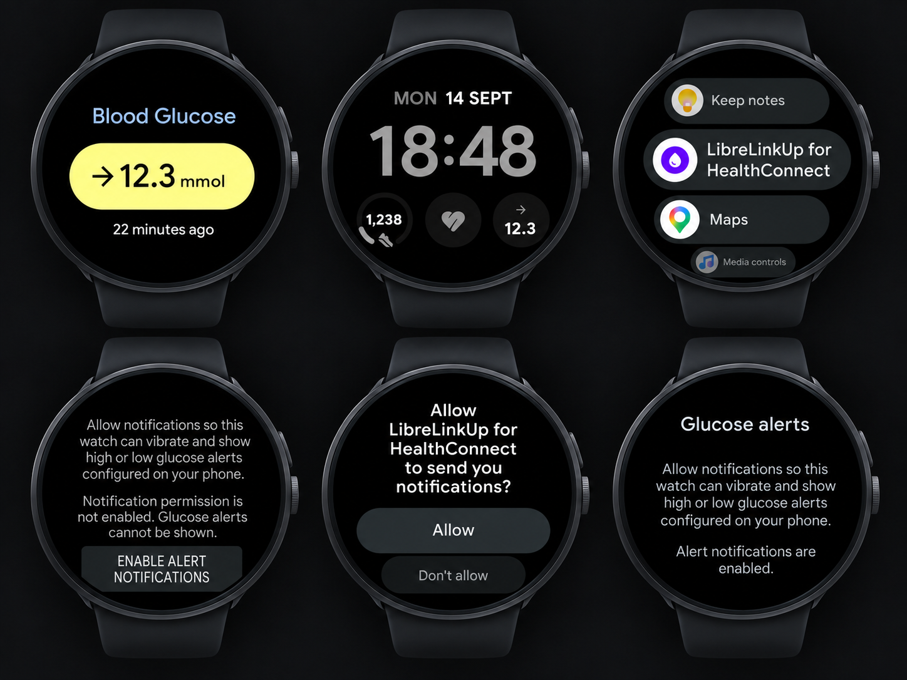

<!--
 Copyright 2026 Sam Steele
 Copyright 2026 omega015
 
 Licensed under the Apache License, Version 2.0 (the "License");
 you may not use this file except in compliance with the License.
 You may obtain a copy of the License at
 
     http://www.apache.org/licenses/LICENSE-2.0
 
 Unless required by applicable law or agreed to in writing, software
 distributed under the License is distributed on an "AS IS" BASIS,
 WITHOUT WARRANTIES OR CONDITIONS OF ANY KIND, either express or implied.
 See the License for the specific language governing permissions and
 limitations under the License.
-->

# HealthConnect-LibreLinkUp

Syncs the latest glucose reading from FreeStyle Libre sensors via LibreLinkUp to Health Connect and Wear OS.

## About this fork

This repository is a maintained fork of Sam Steele's original [HealthConnect-LibreLinkUp](https://github.com/c99koder/HealthConnect-LibreLinkUp) project.

The original project remains the foundation of the application. This fork, maintained by **omega015**, retains that core architecture while adding substantial phone and Wear OS functionality, including configurable foreground syncing, glucose alerts, unit selection, phone-to-watch settings confirmation and additional reliability improvements.

See [CHANGELOG.md](CHANGELOG.md) for the detailed release history and the changes introduced by this fork.

## Screenshots

### Phone app

  

### Wear OS

  

## Features

- Sync LibreLinkUp glucose readings to Health Connect.
- Standard Android background sync or configurable Fast sync using a foreground service.
- Fast sync intervals from 1 to 30 minutes.
- Wear OS Tile and complication showing the latest glucose reading.
- Selectable watch display units: mmol/L or mg/dL.
- Optional low and high glucose alerts on the watch.
- Configurable alert thresholds, re-arm margins (hysteresis), repeat intervals and persistent vibration.
- Phone-to-watch settings confirmation so the phone can report whether alert settings reached the watch.
- LibreView regional endpoint support, including automatic regional redirects.

## Requirements

- Android 9.0+
- [Google Health Connect](https://play.google.com/store/apps/details?id=com.google.android.apps.healthdata) (built in on Android 14+)
- Android Wear OS 3.0+ for the optional watch app
- FreeStyle Libre 2 or 3 glucose sensor linked to a [LibreLinkUp](https://librelinkup.com/) account

## Install

Download the [latest release](https://github.com/omega015/HealthConnect-LibreLinkUp/releases/latest) and install `app-release.apk` on your phone. Install the optional `wearable-release.apk` on your Wear OS watch.

### Existing installations

This fork uses its own release signing key. Android therefore cannot install it as an update over a version signed by the original developer or over a debug build. If either is already installed, uninstall that copy before installing this fork's release APK. Uninstalling clears that app's local settings, so you will need to log in and configure it again.

Once this fork's signed release has been installed, future releases signed with the same key can update it normally.

## Usage

Open the FreeStyle Libre app and tap **Connected Apps**, then send yourself an invitation to view your data through LibreLinkUp. Install the LibreLinkUp app, log in and accept the invitation.

Launch **LibreLinkUp for HealthConnect** on your phone, select your LibreView region, enter your LibreLinkUp email address and password, then log in.

Under **Glucose sync**, choose either Standard or Fast mode. Standard uses Android background scheduling at a 15-minute interval and may be batched or delayed by Android. Fast mode uses a foreground service for more dependable updates. Fast mode can continue to operate when the phone's notification permission is disabled, although Android may still show the service under Active apps depending on the OS version.

Install the Wear OS app (`wearable-release.apk`) on the watch and grant notification permission if you want watch glucose alerts. The Tile and complication can display the latest reading in either mmol/L or mg/dL.

Under **Watch glucose alerts** on the phone, you can configure low and high thresholds, re-arm margins, repeat alerts and persistent vibration, then send those settings to the watch.

> Watch alerts depend on LibreLinkUp cloud availability, phone syncing and Wear connectivity. They are not a replacement for Abbott/Libre medical alarms.

## Project attribution

This fork is derived from the original **HealthConnect-LibreLinkUp** project by Sam Steele and continues to use the Apache License 2.0.

Original and substantially derived source files retain Sam Steele's copyright notice. Files substantially modified by this fork may also carry a `Copyright (c) 2026 omega015` notice, while new fork-specific source files use the omega015 notice where appropriate.

## License

Copyright (C) 2026 Sam Steele.
Copyright (C) 2026 omega015 for fork-specific additions and modifications where applicable.

Licensed under the Apache License, Version 2.0 (the "License"); you may not use this file except in compliance with the License. You may obtain a copy of the License at

http://www.apache.org/licenses/LICENSE-2.0

Unless required by applicable law or agreed to in writing, software distributed under the License is distributed on an "AS IS" BASIS, WITHOUT WARRANTIES OR CONDITIONS OF ANY KIND, either express or implied. See the License for the specific language governing permissions and limitations under the License.
